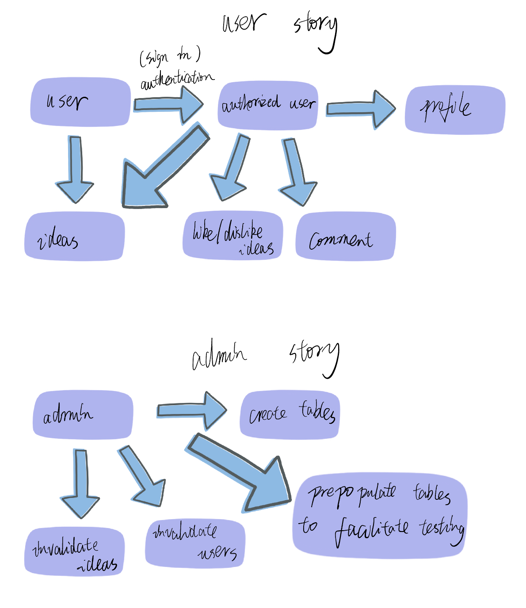
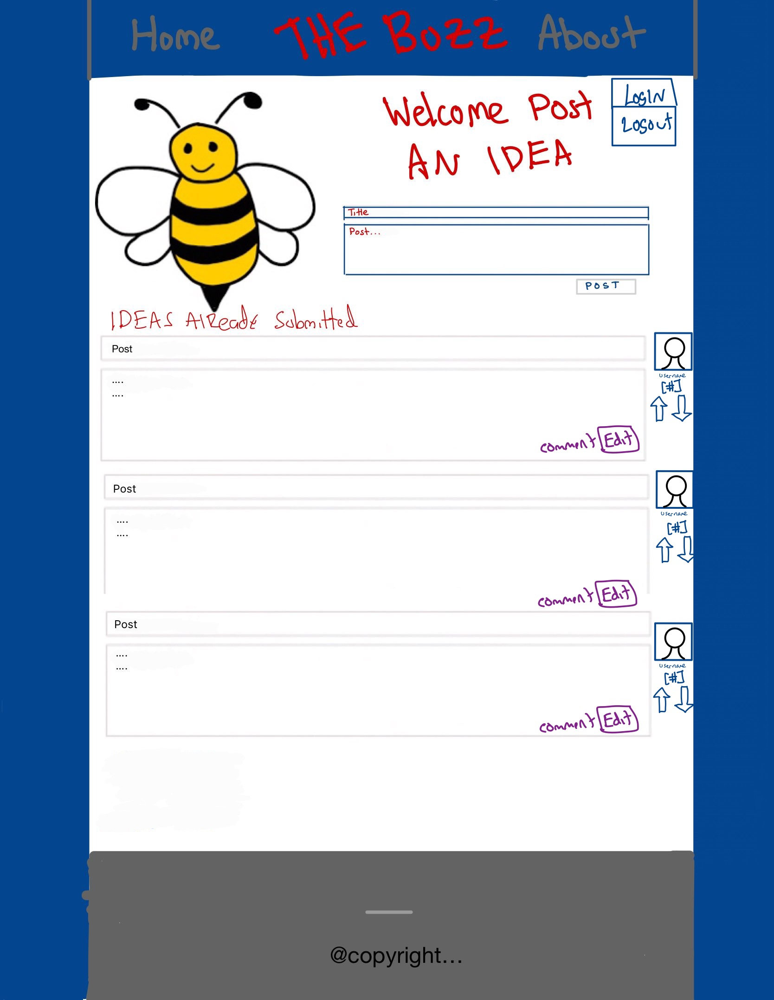
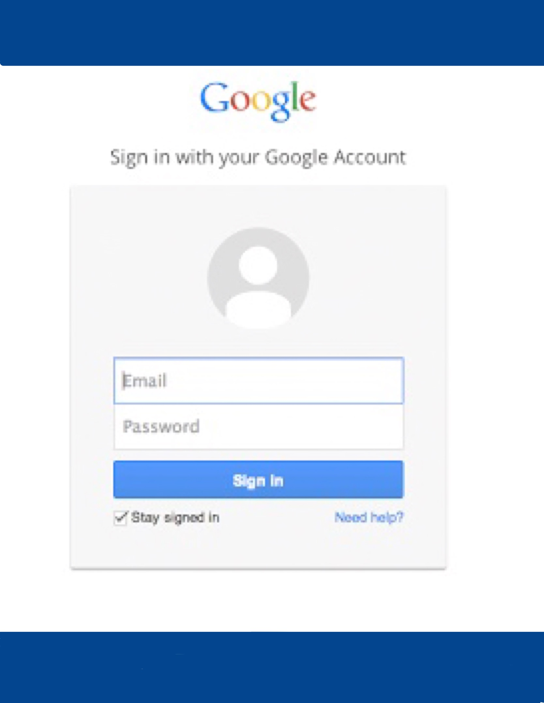
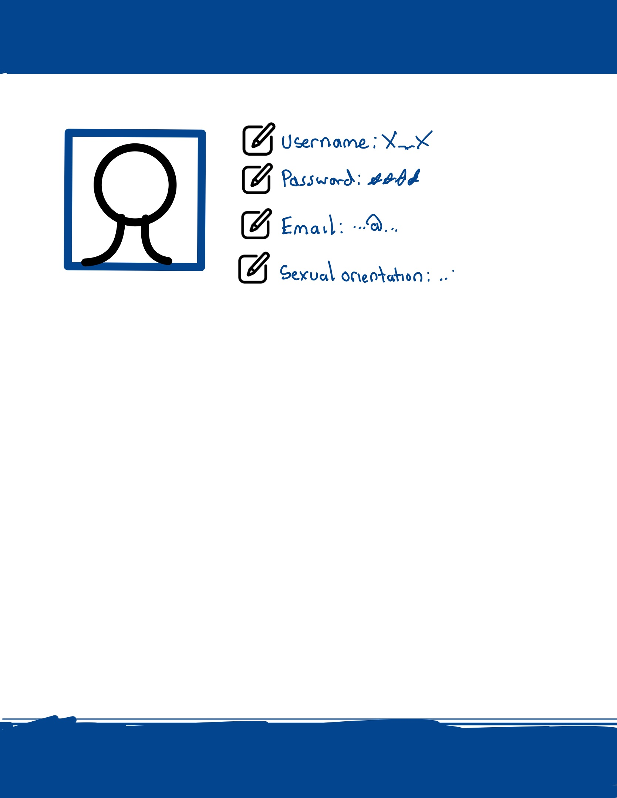

## Listing of User Stories for the Admin and "Anonymous User" Personas:    
#### User and Admin Story:
  

## Tests For Each User Story:    
Tests for user stories will include the authentication process works properly, unauthorized users can only see ideas. authorized users can see their profile, see ideas, like/ dislike ideas and comment on ideas.

Tests for the admin stories will include admin can create tables, admin can prepopulate tables for testing, admin can invalidate redundant ideas and admin can invalidate users. Invalid idea will not be shown anymore. Invalid users can not log in.

## System Drawing:    

## Drawing of Mock Web/Mobile User Interface:
#### Web
    
  
 
#### Mobile

  
 

## Drawing of State Machine:      

## New Idea State Machien Diagram

## Listing of Routes:    
* /  -> goes to index.html  
    * Default starting page
    * Gets user’s session ID and confirms it is valid
* /message/:id -> get, put, delete, post  
    * Allows users to get a specific post
    * Allows users to update a specific post
    * Allows users to delete a specific post
    * Allows users to create a specific post
    * Passes the int ID of the post variable for manipulation of specific entry
    * Gets user’s session ID and confirms it is valid
* /messages -> get  
    * Allows users to get all posts
    * Gets user’s session ID and confirms it is valid
* /addLike/:id -> post  
    * Allows users to add a like to a specific post 
    * Passes the int ID of the post variable for "Like" manipulation of specific entry
    * Gets user’s session ID and confirms it is valid
* /updateLike/:id -> put  
    * Allows user to remove one like from a post
    * Passes the int ID of the post variable for "Like" manipulation of specific entry
    * Gets user’s session ID and confirms it is valid
* /addDislike/:id -> post
    * Allows user to add a dislike to a specific post
    * Passes the int ID of the post variable for the “dislike” manipulation of a
    * Gets user’s session ID and confirms it is valid specific entry 
* /updateDislike/:id -> put  
    * Allows user to remove one dislike from a post
    * Passes the int ID of the post variable for "Dislike" manipulation of specific
    * Gets user’s session ID and confirms it is valid entry
* /comment/:id -> put, post
    * Allows user to add a comment to a specific post  
    * Allows users to update a specific post
    * Gets user’s session ID and confirms it is valid

## Entity Relationship Diagram:    
  

## Listing of Tests for Backend, Admin, Web, and Mobile:  
* Mobile Tests:  
    * Tests if user can see list of ideas
    * Tests if user can create new ideas
    * Test login and logout with Google OAuth
    * Test adding an editable comment to an idea
    * Test displaying user profile information
    * Test upvoting and downvoting an idea
* Admin tests:  
    * Tests if admin can add a create a table
    * Tests if admin can drop/delete a table
    * Tests if admin can remove an entry from a table
    * Invalid User Test
    * Invalid Idea Test
    * Test SQL fucntions from backend (CRUD operations for post and comments)
* Web Tests:  
    * Tests if user can see list of ideas
    * Tests if user can create new ideas
    * Tests if user can remove a like
    * Test for editable comments on ideas
    * Test for the profile page
    * Test for the login and logout area via Google OAuth
    * Test for the up vote and down vote button
* Backend Tests:  
    * Create/delete/update an entry
    * Creating/updating a comment
    * Access an entry (Post) from a group of entries
    * Adding upvote/downvote
    * Updating upvote/downvote
    * Routes by checking that GSON objects pass the expected values
    * CURL for manual test of routes (Other tests are automatic) 
    * Independent OAuth test

## Code Documentation Phase1
* Mobile
    * https://bitbucket.org/jsm225/buzzrepo/src/pre-master/mobile/flutter/my_app/doc/api/index.html  
* Web 
     * https://bitbucket.org/jsm225/buzzrepo/src/pre-master/web/src/App.js 
* Admin
    * https://bitbucket.org/jsm225/buzzrepo/raw/fb86aa327e4b8ddca9669c37ba8dc903d30643eb/docs/MobileMock.png 
    * https://bitbucket.org/jsm225/buzzrepo/src/master/README.md -> section on code documentation
* Backend
    * https://drive.google.com/drive/folders/1nytIR7O-GthNPTK8cNsHIj4RAmGC9S9b?usp=share_link 

## Backlog
* Implement/Update SQL Functions for backend/admin
* Implement/Update Routes
* Implement Google Auth
* Implement web UX/UI
* Implement mobile UX/UI
* Implement/Update SQL Functions
* Unit Tests
* Dokku Running