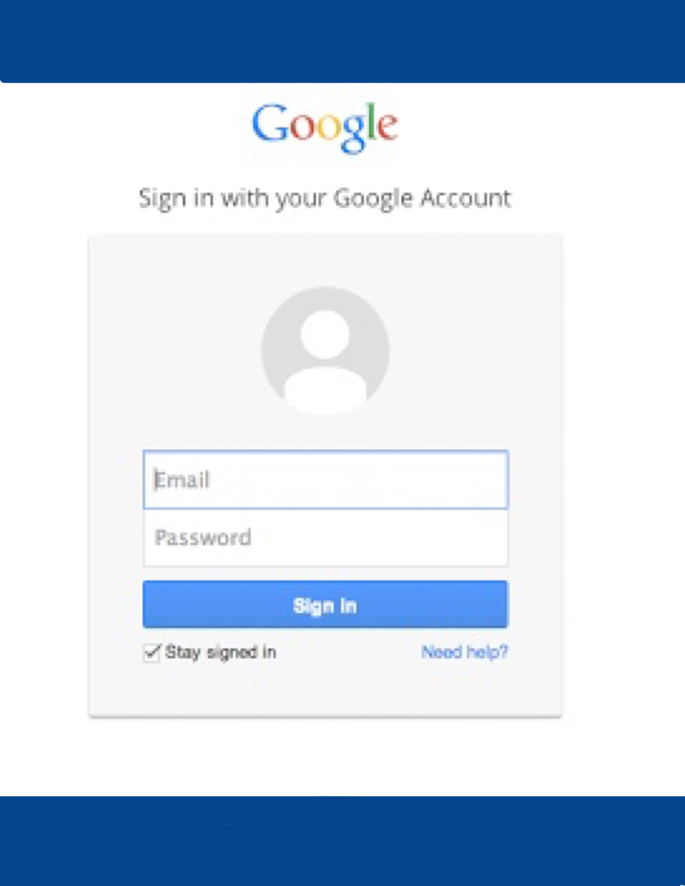
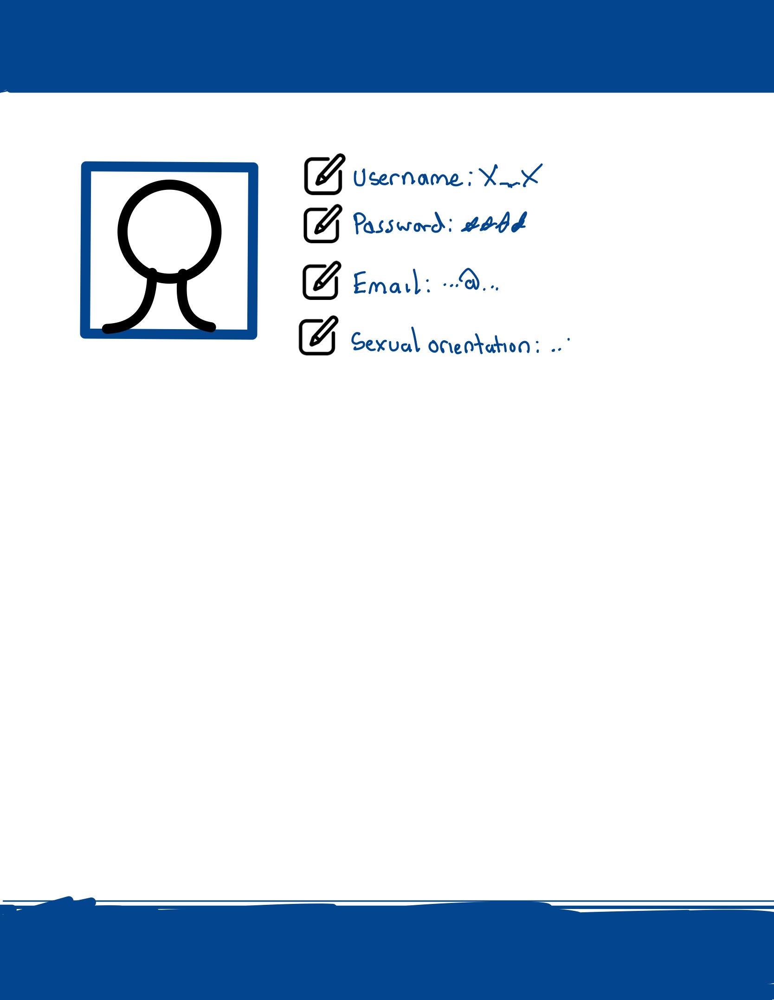
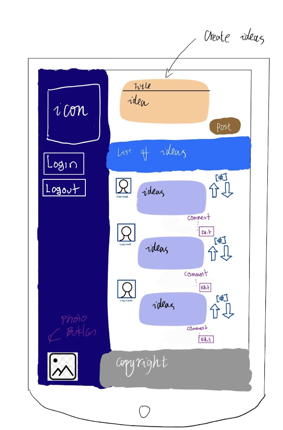

## Listing of User Stories for the Admin and "Anonymous User" Personas:    
#### User and Admin Story:
  

## Tests For Each User Story:  
testUserValidationStatus(){
        //Create a test to get the user's validation status
        //Will assert true with the boolean that states if they're valid or not

testPostValidationStatus(){
        //Create a test to get the post's validation status
        //Will assert true with the boolean that states if the post is valid or not
    }
    
testUpdateUserValidation(){
        //Create a test to update the user's validation status
    }

testUpdatePostValidation(){
        //Create a test to update the post's validation status
    }

## System Drawing:

## Drawing of Mock Web/Mobile User Interface:
#### Web

#### Mobile

## Drawing of State Machine: 

## New Idea State Machien Diagram

## Entity Relationship Diagram:  
  

## Listing of Routes:  
* POST /login
    * Purpose: Authenticate user and start a new session.
    * Format of passed objects: { "username": "<username>", "password": "<password>" }
    * Response: { "token": "<session_token>" }
* POST /logout
    * Purpose: End the current session.
    * Format of passed objects: Authorization: Bearer <session_token>
    * Response: { "message": "Logged out successfully." }
* POST /files
    * Purpose: Upload a new file to the server and store its link in the database.
    * Format of passed objects: Authorization: Bearer <session_token>, { "name": "<file_name>", "file": "<file_data>" }
    * Response: { "id": "<file_id>", "name": "<file_name>", "link": "<file_link>" }
* GET /files/:id
    * Purpose: Download a file with the specified ID.
    * Format of passed objects: Authorization: Bearer <session_token>
    * Response: The file data.
* DELETE /files/:id
    * Purpose: Delete a file with the specified ID.
    * Format of passed objects: Authorization: Bearer <session_token>
    * Response: { "message": "File deleted successfully." }

  

## Description of Unit tests
 
* Mobile Tests:  
    * Test that the camera icon is displayed on the UI, and that tapping it opens the Camera API.
    * Test that the gallery icon is displayed on the UI, and that tapping it opens the Gallery API.
    * Test that the Camera API successfully captures a picture, and that it is displayed on the UI.
    * Test that the Gallery API successfully selects a picture, and that it is displayed on the UI.
    * Test that the app can post a picture to The Buzz using the appropriate API, and that it is displayed on the UI.
    * Test that the local cache is correctly implemented using SharedPreferences, and that content is not re-downloaded unnecessarily.
    * Test that content that is already saved to the device can be posted using the appropriate API, and that it is displayed on the UI.
    * Test that the camera icon is displayed on the UI,
    and that tapping it opens the Camera API.

* Admin tests:  
  * testUserValidationStatus(){
        //Create a test to get the user's validation status
        //Will assert true with the boolean that states if they're valid or not

  * testPostValidationStatus(){
        //Create a test to get the post's validation status
        //Will assert true with the boolean that states if the post is valid or not
    }
    
  * testUpdateUserValidation(){
        //Create a test to update the user's validation status
    }

  * testUpdatePostValidation(){
        //Create a test to update the post's validation status
    }
* Web Tests:  
   * Tests if the user can see a list of ideas
    * Tests if the user can create new ideas
    * Tests if the user can remove an upvote/downvote
    * Tests if the user can add an upvote/downvote
    * Tests if the user can update an upvote/downvote
    * Test for editable comments on ideas
    * Test for the profile page
    * Test for the login and logout area via Google OAuth
    * Test if the user can add links to the ideas or comments
* Backend Tests:  
    * test_login_success: 
    This test should check whether a user can successfully log in with a valid username and password. 
    It should send a POST request to the /login route with valid credentials and check that the response contains a valid session token.

    * test_login_failure: 
This test should check whether a user cannot log in with invalid credentials. 
It should send a POST request to the /login route with invalid credentials and check that the response contains an error message indicating that the login attempt failed.

    * test_logout_success:
This test should check whether a user can successfully log out with a valid session token. 
It should send a POST request to the /logout route with a valid session token and check that the response contains a message indicating that the user has been logged out.

    * test_logout_failure: 
This test should check whether a user cannot log out with an invalid session token. 
It should send a POST request to the /logout route with an invalid session token and check that the response contains an error message indicating that the logout attempt failed.

    * test_upload_file_success: 
This test should check whether a user can successfully upload a file with a valid session token. 
It should send a POST request to the /files route with a valid session token and a file data in the expected format, and check that the response contains a JSON object with the ID, name, and link of the uploaded file.

    * test_upload_file_failure: 
This test should check whether a user cannot upload a file with an invalid session token. 
It should send a POST request to the /files route with an invalid session token and a file data in the expected format, and check that the response contains an error message indicating that the upload attempt failed.

    * test_download_file_success: 
This test should check whether a user can successfully download a file with a valid session token and file ID. 
It should send a GET request to the /files/:id route with a valid session token and file ID, and check that the response contains the file data in the expected format.

    * test_download_file_failure: 
This test should check whether a user cannot download a file with an invalid session token or file ID. 
It should send a GET request to the /files/:id route with an invalid session token or file ID, and check that the response contains an error message indicating that the download attempt failed.

    * test_delete_file_success: 
This test should check whether a user can successfully delete a file with a valid session token and file ID. 
It should send a DELETE request to the /files/:id route with a valid session token and file ID, and check that the response contains a message indicating that the file has been deleted successfully.

    * test_delete_file_failure: 
This test should check whether a user cannot delete a file with an invalid session token or file ID. 
It should send a DELETE request to the /files/:id route with an invalid session token or file ID, and check that the response contains an error message indicating that the deletion attempt failed.

## Backlog
* All routes (Except for adding/retrieving posts) and Google Oauth. Code structure ready for quick implementation.
* Dokku Running
* Upvotes/Downvotes/Commenting for mobile
* More unit test for backend