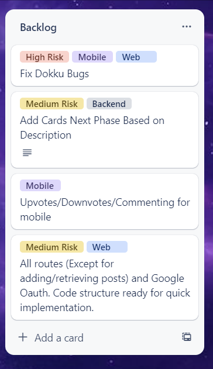

# Phase 3 Sprint 11 - PM Report Template
Use this form to provide your project manager report for Phase 3 Sprint 11.  Please give detailed answers.
In addition to uploading to coursesite, version control this in the `master` branch under the `docs` folder.

## Team Information [10 points]

Team Information:
* Number: 17
* Name: Team Power
* Mentor: Ayon Bhowmick, ayb224@lehigh.edu

Team Roles:
* Project Manger: Mo Wu, mow225@lehigh.edu
* Backend developer: Jonah Burd, job224@lehigh.edu
* Admin developer: Mackenzie Kramer, mjk224@lehigh.edu
* Web developer: Alonso Cornejo Leon, dac323@lehigh.edu
* Mobile developer: Jack Mishkin, jsm225@lehigh.edu 

Essential links for this project:
* Team's Dokku URL(s) (live web front-end link)
    * http://2023-group17.dokku.cse.lehigh.edu
    * http://192.168.0.167:3000 
* Team's software repo (bitbucket)
    * https://bitbucket.org/jsm225/buzzrepo/src/master/
* Team's Trello board
    * https://trello.com/invite/b/dsq853yg/ATTIed0f703de086d126546c4ae44fdfe80043733BB6/team-power-phase-1

## Backlog and Tech-debt [15 points total]

### Screenshot of Trello board [5 points]

 

### List of all backlog and tech debt items [10 points]
 * All routes (Except for adding/retrieving posts) and Google Oauth. Code structure ready for quick implementation for web
* Dokku Running
* Upvotes/Downvotes/Commenting for mobile
* More unit test for backend

## Role reporting [75 points total, 15 points each (teams of 4 get 15 free points)]
Report-out on each role, from the PM perspective.
You may seek input where appropriate, but this is primarily a PM related activity.

### Back-end

1. Describe the engagement of the developer with the team (communication with the team - use of Slack and Trello, attendance and participation in meetings, etc.)
    * Backend communicate actively with team member using messages and slack. Backend developer also present on classes and meeting.
2. Assess the effort given by the developer in understanding the required changes and their impact on the code they are responsible for in this phase
    * Backend developer updates the list of routes for phase 3 and write full description of the test he will implement for the phase 3.
3. Did the developer review the Phase 2 version of the code with the person who last owned it?
    * Yes. The backend developer checked the code with the backend developer for last phase and discuss what they have done for phase 2.

### Admin

1. Describe the engagement of the developer with the team (communication with the team - use of Slack and Trello, attendance and participation in meetings, etc.)
    * Admin and group members communicate a lot and are present in the classroom every lesson.  Admins attend meetings on time, and post questions on slack.
2. Assess the effort given by the developer in understanding the required changes and their impact on the code they are responsible for in this phase
    * This sprint is design based. Admin draw the new user and admin stories fully. Admin develop description of user based and admin based test. There are no backlog for admin from 
    last phase, so there is no code change for admin for this sprint, but admin have understand all the changes required for this phase.
3. Did the developer review the Phase 2 version of the code with the person who last owned it?
    * Admin has reviewed the Phase 2 version of the code with the person who last owned it and ad min knows what need to change for this phase.

### Web

1. Describe the engagement of the developer with the team (communication with the team - use of Slack and Trello, attendance and participation in meetings, etc.)
    * Web developer communicate with the team actively and present durin the class and meeting. Discuss with team members actively.

2. Assess the effort given by the developer in understanding the required changes and their impact on the code they are responsible for in this phase
    * Cause there are too many tech debt from Phase 2 for web. the web developer of this phase spent a lot of time to eliminate the tech debt from last phase, but there are still some tech debt reamaining like Oauth.
3. Did the developer review the Phase 2 version of the code with the person who last owned it?
    * Yes, the web developer review the code with web developer of last phase.

### Mobile

1. Describe the engagement of the developer with the team (communication with the team - use of Slack and Trello, attendance and participation in meetings, etc.)
    * Mobile developer also communicate effectively with team members and shown up in class and meeting.
2. Assess the effort given by the developer in understanding the required changes and their impact on the code they are responsible for in this phase
    * The mobile developer add the CameraAPI in the code which will allow thw user to upload picture. But I think he may need to work more on adding files.
3. Did the developer review the Phase 2 version of the code with the person who last owned it?
    * Yes. The mobile developer checked with last mobile developer about what he did in phase 2 and decribe the structure of all the flutter files.

### Project Management
Self-evaluation of PM performance

1. When did your team meet with your mentor, and for how long?
    * Friday 10am for 20 minutes.
1. Describe your use of Trello.  Did you have too much detail?  Too little?  Just enough? Did you implement policies around its use (if so, what were they?)?
    * I have many small tasks with just enough detail
    * I added labels for each card to imply the risk of it and which role it belongs to.
1. How did you conduct team meetings?  How did your team interact outside of these meetings?
    * I think our meeting is effective. We complete our ERD, system diagram and state mechine together and checked with Ayon.
    * We communication actively outside the meeting using messages and slack. 
1. What techniques (daily check-ins/scrums, team programming, timelines, Trello use, group design exercises) did you use to mitigate risk?
    * I use trello to remind everyone about each task they need to do and set a deadline for each task.
    * I check the progress with each member everyday to make sure that they are not behind and if they have any problems, we can solve it together.
1. Describe any difficulties you faced in managing the interactions among your teammates? Were there any team issues that arose?
    * I think there are too many tech debt for Web for phase 2 but everyone works hard to complete their own works
1. How well did you estimate time during the early part of the phase?  How did your time estimates change as the phase progressed?
    * I think all of our members spent around 4 hours on their work and I think this time many increase as the phase progressed because we need to fix all the tech debt.
1. What aspects of the project would cause concern for your customer right now, if any?
    * I think running on dokku will be a headache. Web have too many tech debt for phase2.
1. What is your biggest concern as you think ahead to the next phase of the project?
    * This phase is actually the last phase.
1. Describe the most significant obstacle or difficulty your team faced.
    * The finals are coming. Hope everyone will still work hard on their own work.