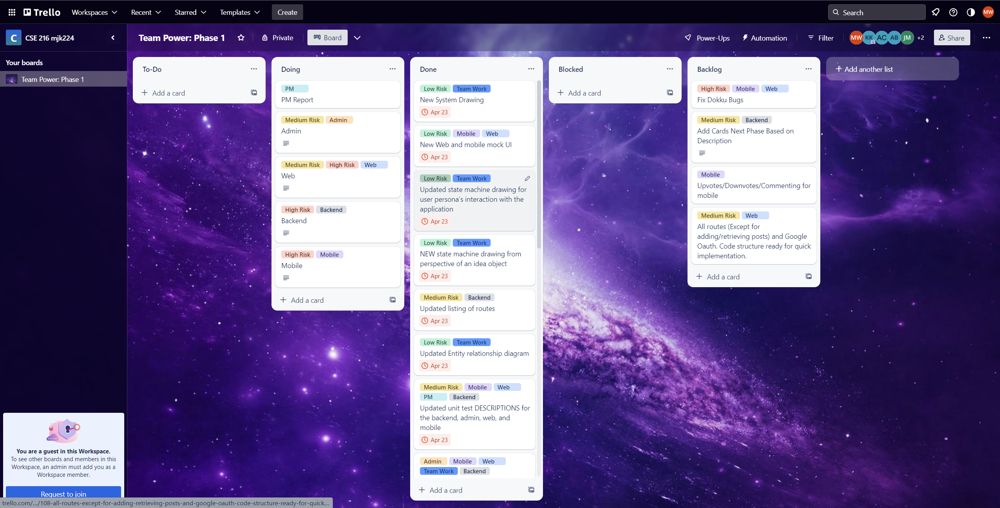
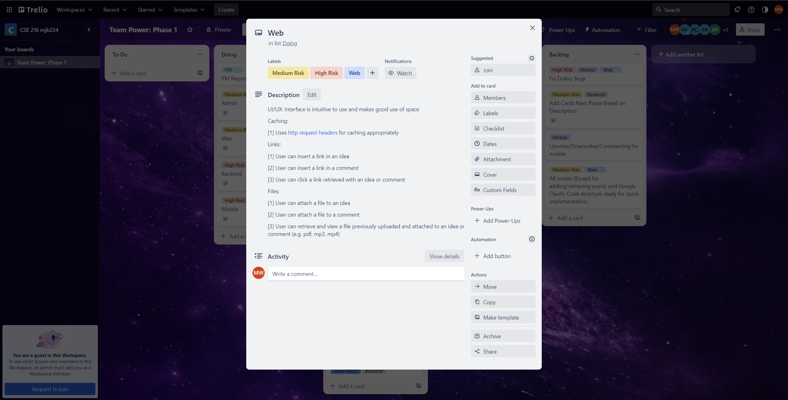
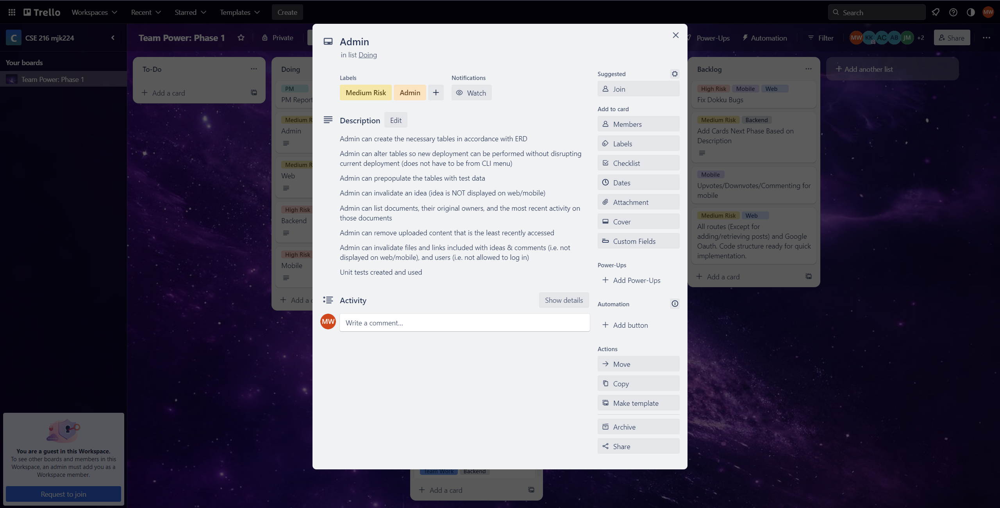
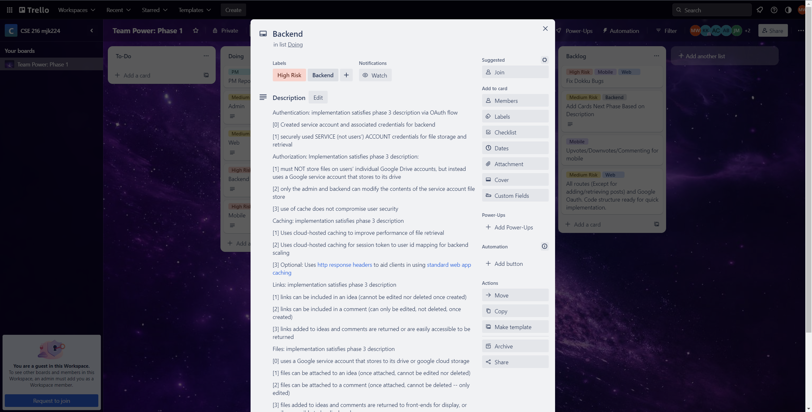
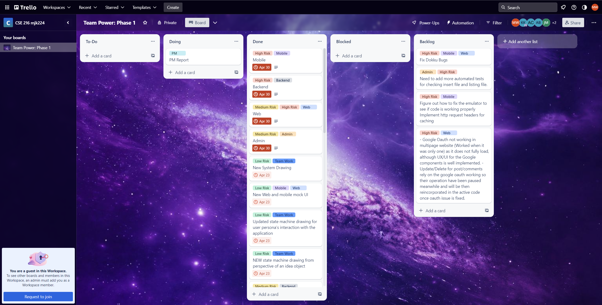
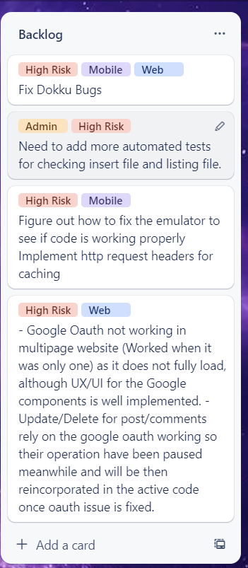

# Phase 3 Sprint 12 - PM Report Template
Use this form to provide your project manager report for Phase 3 Sprint 12.  Please give detailed answers.
In addition to uploading to coursesite, version control this in the `master` branch under the `docs` folder.

## Team Information [15 points]

Team Information:
* Number: 17
* Name: Team Power
* Mentor: Ayon Bhowmick, ayb224@lehigh.edu

Team Roles:
* Project Manger: Mo Wu, mow225@lehigh.edu
* Backend developer: Jonah Burd, job224@lehigh.edu
* Admin developer: Mackenzie Kramer, mjk224@lehigh.edu
* Web developer: Alonso Cornejo Leon, dac323@lehigh.edu
* Mobile developer: Jack Mishkin, jsm225@lehigh.edu 

Essential links for this project:
* Team's Dokku URL(s) (live web front-end link)
    * http://2023-group17.dokku.cse.lehigh.edu
    * http://192.168.0.167:3000 
* Team's software repo (bitbucket)
    * https://bitbucket.org/jsm225/buzzrepo/src/master/
* Team's Trello board
    * https://trello.com/invite/b/dsq853yg/ATTIed0f703de086d126546c4ae44fdfe80043733BB6/team-power-phase-1

## Backlog [10 points total, 5 points each]

### Screenshot of Trello board at beginning of sprint:
 
 
 
 
 

### Screenshot of Trello board at end of sprint:
(should match/support list of backlog and tech debt items in subheadings below)

## Role reporting [75 points total, 15 points each (teams of 4 get 15 free points)]
Report-out on each role, from the PM perspective.
You may seek input where appropriate, but this is primarily a PM related activity.

### Back-end

1. Describe the engagement of this component's developer with the team (How effective was the process? How was communication with the team - use of Slack and Trello, attendance and participation in meetings, etc. How were tasks created? How was completion of tasks verified?)
    * Backend developer appear in one of this week's class and communicate with the team member effectively. He do a code review with me so I can know how's the task going.
2. Assess the completeness of this component (list remaining backlog item(s), if any)
    * Routes are redesigned for file uploads. Google cloud and drive are set up.
    * Caching implementation on the cloud-host still uses a hash
    * commenting files/links attachment is fidgety 
3. List your back-end's REST API endpoints
    * /
    * /messages
    * /messages/:id
    * /likes/:id
    * /addUser
    * /updateUser/genderIdentity/:username
    * /updateUser/sexualOrientation/:username
    * /updateUser/note/:username
    *  /upVote/update/:username
    * /addComment
    * /downVote/update/:username
    * /comment/:id
    * /addComment/:id
    * /commentByUsername/:username
    * POST /login
    * POST /logout
    * POST /files
    * GET /files/:id
    * DELETE /files/:id
    
4. Assess the quality of the back-end code
    * The quality of the backend's code is not that solid cause some of the routes for the frontend to access the google drive is not working.
5. Describe the code review process you employed for the back-end
    * We go throught the code together and he told me about what which route is used for and how the google credentials works.
6. What was the biggest issue that came up in code review of the back-end server?
    * Some of the routes are not set properly and caching is not implmented successfully.
7. Is the back-end code appropriately organized into files / classes / packages?
    * The code is organized. Each class has its own name which indicate the funtion of the class. All the code are in the correct packages.
8. Are the dependencies in the pom.xml file appropriate? Were there any unexpected dependencies added to the program?
    * The dependency in the pom.xml is appropriate. Google drive dependency is added to it and there is no unexpected dependencies.
9. Evaluate the quantity and quality of the unit tests for the back-end
    * More unit tests should be developed for backend. The tests now are not enough.
10. Describe any technical debt you see in the back-end, if any
    * Some of the routes are not working. It's a big issue which will affect other part's work.
    * Caching implementation on the cloud-host still uses a hash
    * commenting files/links attachment is fidgety 

### Admin

1. Describe the engagement of this component's developer with the team (How effective was the process? How was communication with the team - use of Slack and Trello, attendance and participation in meetings, etc. How were tasks created? How was completion of tasks verified?)
    * Admin attend all the meeting and class. She communicate effectively with me and teammate. We do pair programming together. So, I know how's the completion of tasks.
2. Assess the completeness of this component (list remaining backlog item(s), if any)
    * Most of the fuctions are added. Tables can be created successfully and invalidation also works. We can't test whether we can upload file cause some of the routes are not working now.
    * Need to add more automated tests for checking insert file and listing file.
3. Describe the tables created by the admin app
    * Userdata is used for store user infomation whcih have username, email, gender identity, sexual orientation and Note.
    * Post is used for store the post information which have ID, title, content, created time, upvote, downvote and File ID if there are any files uploaded.
    * Comment is used for store the comment infomation which have ID, content, created time and FileID.
    * Action is used for store information about different actions whcih have A-ID, Type and TMS.
    * File is used for store information about files which have FileID, URL, PostID, CommentID, UserID and LastRetrived.
4. Assess the quality of the admin code
    * The quality of the admin code is really solid.
5. Describe the code review process you employed for the admin app
    * We do pair programming together so I understand every part of the admin code.
6. What was the biggest issue that came up in code review of the admin app?
    * There is no big issue from admin as long as backend is set correctly next week.
7. Is the admin app code appropriately organized into files / classes / packages?
    * The code from admin is organized into files, classes and packages.
8. Are the dependencies in the pom.xml file appropriate? Were there any unexpected dependencies added to the program?
    * Google drive dependency is added and there is no unexpected dependencies.
9. Evaluate the quantity and quality of the unit tests for the admin app
    * The description of the unit test for admin is solid and but more unit test are needed.
10. Describe any technical debt you see in the admin app, if any
    * No tech debt from admin.

### Web

1. Describe the engagement of this component's developer with the team (How effective was the process? How was communication with the team - use of Slack and Trello, attendance and participation in meetings, etc. How were tasks created? How was completion of tasks verified?)
    * The web developer attend all the classes and meeting this week and communicate with teammate effectively. We sit together to debug for admin and web. He show me the functionality and UI he has to verify the completion of the tasks.
2. Assess the completeness of this component (list remaining backlog item(s), if any)
    * Web developer fix all the tech debt from phase 2 and have all the UI working. He harcoded some of the backend stuff to test.
    * Google Oauth not working in multipage website (Worked when it was only one) as it does not fully load, although UX/UI for the Google components is well implemented.
    * Update/Delete for post/comments rely on the google oauth working so their operation have been paused meanwhile and will be then reincorporated in the active code once oauth issue is fixed.
3. Describe the different models and other templates used to provide the web front-end's user interface
    * App: the model for the app
    * Commnets: used for entering and upadting comments from users.
    * Google button is used for google sign in and log out.
    * Home is used for the home page
    * NewPost is used for the new idea the user post.
    * Post is used for the exsting posts
    * Profile is used for the profile page for every user.

4. Assess the quality of the Web front-end code
    * The quality of the code is solid and every works well.
5. Describe the code review process you employed for the Web front-end
    * He show me the code and explain each part for me. He also show all the corresponding functionality to me.
6. What was the biggest issue that came up in code review of the Web front-end?
    * I think Web is in a good shape and everything works fine.
7. Is the Web front-end code appropriately organized into files / classes / packages?
    * Code from web are appropriately organized into files, classes and packages.
8. Are the dependencies in the package.json file appropriate? Were there any unexpected dependencies added to the program?
    * Google drive dependency is added in package.json and there are no unexpected dependencies.
9. Evaluate the quantity and quality of the unit tests for the Web front-end 
    * More unit test should be added. The exsiting unit tests works well.
10. Describe any technical debt you see in the Web front-end, if any
    * No tech debt for web.

### Mobile

1. Describe the engagement of this component's developer with the team (How effective was the process? How was communication with the team - use of Slack and Trello, attendance and participation in meetings, etc. How were tasks created? How was completion of tasks verified?)
    * The mobile developer attend all the classes and meeting. He communicate with teammate but not that effectively. He show me the code he have to verify the completion of tasks.
2. Assess the completeness of this component (list remaining backlog item(s), if any)
    * He add the component ot upload files and pictures, but I can't see the UI from him because the emulator is not working on his computer.
3. Describe the activities that comprise the Mobile app
    * Our mobile app allows the user to see a list of ideas, create a list of ideas, delete ideas, and like ideas. Also add and edit comments. More allows user google login and to see his or her profile. Also, the user can attach files in a post and list.
4. Assess the quality of the Mobile code
    * The quality of the code from mobile is not that solid. Many things can't be verified whether it's working or not.
5. Describe the code review process you employed for the Mobile front-end
    * He show me his code and explain what he added for this phase and what does these functions use for.
6. What was the biggest issue that came up in code review of the Mobile front-end?
    * The emulator is not working for mobile. So, actually he can't test whether his code works or not.
7. Is the Mobile front-end code appropriately organized into files / classes / packages?
    * The mobile code are organized into files, classes and packages appropriately.
8. Are the dependencies in the pubspec.yaml (or build.gradle) file appropriate? Were there any unexpected dependencies added to the program?
    * He added dependency for google drive into the pubspec.yaml and there are no unexpected dependencies.
9. Evaluate the quantity and quality of the unit tests for the Mobile front-end here
    * More unit tests should be added. The description is fine.
10. Describe any technical debt you see in the Mobile front-end, if any
    * Figure out how to fix the emulator to see if code is working properly
    Implement http request headers for caching

### Project Management
Self-evaluation of PM performance

1. When did your team meet with your mentor, and for how long?
    * We meet with Ayon on Friday morning for 20 minutes.
2. Describe your use of Trello.  Did you have too much detail?  Too little?  Just enough? Did you implement policies around its use (if so, what were they?)?
    * I think I use trello board just enough. I add the card for each role and set the deadline for them.
3. How did you conduct team meetings?  How did your team interact outside of these meetings?
    * Our team meeting is effective. We go through the deliverables together and talk about each roles task. We also use message and slack to talk to each other. 
4. What techniques (daily check-ins/scrums, team programming, timelines, Trello use, group design exercises) did you use to mitigate risk?
    * I, Alonso and Kenz we three have a team programming for admin part. I think it's a really effectiv way to do the coding.
    * We use trello to keep track of what we have done and what we need to do next.
5. Describe any difficulties you faced in managing the interactions among your teammates? Were there any team issues that arose?
    * Our team actualy work very effectively and there are not many difficulties.
6. How well did you estimate time during the early part of the phase?  How did your time estimates change as the phase progressed?
    * My estimation is almost accurate. I think for the next phase we will need to spend more time cause it's the last sprint.
7. What aspects of the project would cause concern for your customer right now, if any?
    * The emulator for mobile is not working so the customer can check the functionality actually works.
8. What is your biggest concern as you think ahead to the project's close? What should be done to prepare the project for archive or transition to an entirely new team?
    * The same as last week, the finals are coming. Hope everyone can keep working hard.
9. Describe the most significant obstacle or difficulty your team faced.
    * Backend should fix his routes as soon as possible.