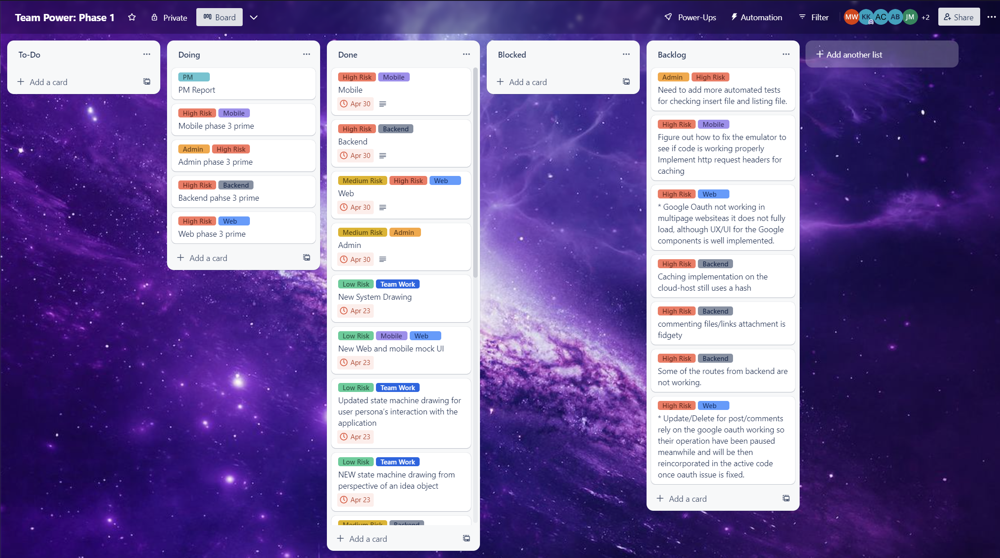
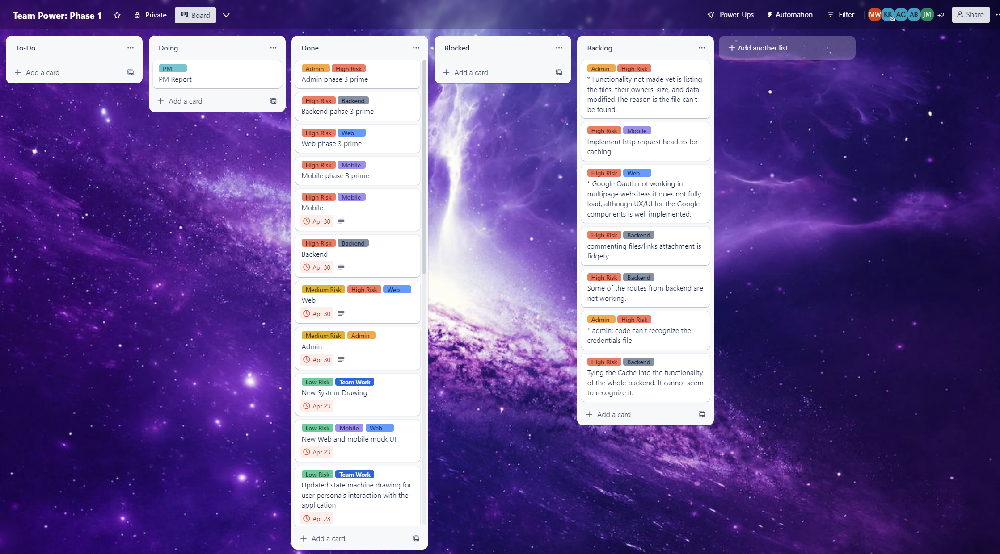

# Phase 3' Sprint 13 - PM Report Template
Use this form to provide your project manager report for Phase 3' (Prime).  Please give detailed answers.
In addition to uploading to coursesite, version control this in the `master` branch under the `docs` folder.

## Team Information [10 points]

Team Information:
* Number: 17
* Name: Team Power
* Mentor: Ayon Bhowmick, ayb224@lehigh.edu

Team Roles:
* Project Manger: Mo Wu, mow225@lehigh.edu
* Backend developer: Jonah Burd, job224@lehigh.edu
* Admin developer: Mackenzie Kramer, mjk224@lehigh.edu
* Web developer: Alonso Cornejo Leon, dac323@lehigh.edu
* Mobile developer: Jack Mishkin, jsm225@lehigh.edu 

Essential links for this project:
* Team's Dokku URL(s) (live web front-end link)
    * http://2023-group17.dokku.cse.lehigh.edu
    * http://192.168.0.167:3000 
* Team's software repo (bitbucket)
    * https://bitbucket.org/jsm225/buzzrepo/src/master/
* Team's Trello board
    * https://trello.com/invite/b/dsq853yg/ATTIed0f703de086d126546c4ae44fdfe80043733BB6/team-power-phase-1

## Beginning of Phase 3' [20 points]
Report out on the Phase 3 backlog and any technical debt accrued during Phase 3.

1. What required Phase 3 functionality was not implemented and why? 
    * admin
        * We can't test whether we can upload file cause some of the routes are not working now.
        * Need to add more automated tests for checking insert file and listing file.  
    * web
        * Google Oauth not working in multipage website (Worked when it was only one) as it does not fully load, although UX/UI for the Google components is well implemented.
        * Update/Delete for post/comments rely on the google oauth working so their operation have been paused meanwhile and will be then reincorporated in the active code once oauth issue is fixed.
    * backend
        * Caching implementation on the cloud-host still uses a hash
        * commenting files/links attachment is fidgety 
    * mobile
        * can't see the UI from him because the emulator is not working on his computer
    
2. What technical debt did the team accrue during Phase 3?
    * Some of the routes from backend are not working.
    * Implement http request headers for caching from mobile

Screenshot of Trello board (at the beginning of Phase 3'):
(should match/support list of backlog and tech debt items)
 

## End of Phase 3' [20 points]
Report out on the Phase 3' backlog.

1. What required Phase 3 functionality still has not been implemented or is not operating properly and why?
    * admin
        * Functionality not made yet is listing the files, their owners, size, and data modified.The reason is the file can't be found.
    * web
        * web developer forgot to mention upvote/downvote as last week's backlog. He fix it in this sprint.
        * Google Oauth not working in multipage website (Worked when it was only one) as it does not fully load because of backend issue, although UX/UI for the Google components is well implemented.
    * backend
        * Tying the Cache into the functionality of the whole backend. It cannot seem to recognize it.
        * commenting files/links attachment is fidgety 
    * mobile 
        * Implement http request headers for caching from mobile
2. What technical debt remains?
    * admin: code can’t recognize the credentials file
    * Some of the routes from backend are not working.
    * Implement http request headers for caching from mobile
Screenshot of Trello board (at the close of Phase 3'):
(should match/support list of backlog and tech debt items)

## Role reporting [50 points total, 10 points each (teams of 4 get 10 free points)]
Report-out on each team members' activity, from the PM perspective (you may seek input where appropriate, but this is primarily a PM related activity).

1. If there was any remaining Phase 3 functionality that needed to be implemented in Phase 3', what did the PM do to assist in the effort of getting this functionality implemented and operating properly?
    * I did the pair programming with the admin and spent a lot of time trying to fix the file not found problem.

### Back-end

1. What did the back-end developer do during Phase 3'?
    * The backend developer fixed the google drive issue and move the credentials.json to a new folder named resource.
    * generate documentation
2. Describe the engagement of this component's developer with the team (How effective was the process? How was communication with the team - use of Slack and Trello, attendance and participation in meetings, etc. How were tasks created? How was completion of tasks verified?)
    * Backend developer appear in one of this week's class and communicate with the team member effectively. He do a code review with me so I can know how's the task going.
3. Assess the completeness of this component (list remaining backlog item(s), if any)
    * Google cloud and drive are set up.
    * Routes are redesigned for file uploads.
    * Tying the Cache into the functionality of the whole backend. It cannot seem to recognize it.
    * commenting files/links attachment is fidgety 
4. List your back-end's REST API endpoints
    * /
    * /messages
    * /messages/:id
    * /likes/:id
    * /addUser
    * /updateUser/genderIdentity/:username
    * /updateUser/sexualOrientation/:username
    * /updateUser/note/:username
    *  /upVote/update/:username
    * /addComment
    * /downVote/update/:username
    * /comment/:id
    * /addComment/:id
    * /commentByUsername/:username
    * POST /login
    * POST /logout
    * POST /files
    * GET /files/:id
    * DELETE /files/:id
5. Assess the quality of the back-end code
    * The quality of the backend's code is not that solid.
    * The backend try to fix the googlg cloud issue by moving the credentials into another resource folder
6. Describe the code review process you employed for the back-end
    * We go through the code together and he told me what causes the backlogs for last week and how he fixed it.
7. What was the biggest issue that came up in code review of the back-end server?
    * Some of the routes are still not working. It affect other roles' part.
8. Is the back-end code appropriately organized into files / classes / packages?
    * The code is organized. Each class has its own name which indicate the funtion of the class. All the code are in the correct packages.
9. Are the dependencies in the pom.xml file appropriate? Were there any unexpected dependencies added to the program?
    * The dependency in the pom.xml is appropriate. Google drive dependency is added to it and there is no unexpected dependencies.
10. Evaluate the quantity and quality of the unit tests for the back-end
    * More unit tests should be developed for backend. The tests existing are solid.
11. Describe any technical debt you see in the back-end, if any
    * Some of the routes are not working. 
    * Tying the Cache into the functionality of the whole backend. It cannot seem to recognize it.
    * commenting files/links attachment is fidgety
### Admin

1. What did the admin front-end developer do during Phase 3'?
    * She tried to list all the documents from google drive but the database jsut return null.
    * She tried to figure out the file not found problem
    * Add more unit tests for existing funtionalities.
    * generate documentation
2. Describe the engagement of this component's developer with the team (How effective was the process? How was communication with the team - use of Slack and Trello, attendance and participation in meetings, etc. How were tasks created? How was completion of tasks verified?)
    * Admin attend all the meeting and class. She communicate effectively with me and teammate. We do pair programming together. So, I know how's the completion of tasks.
3. Assess the completeness of this component (list remaining backlog item(s), if any)
    * Most of the fuctions are added. Tables can be created successfully and invalidation also works. We try to access the google cloud but the databse return null.
4. Describe the tables created by the admin app
    * Userdata is used for store user infomation whcih have username, email, gender identity, sexual orientation and Note.
    * Post is used for store the post information which have ID, title, content, created time, upvote, downvote and File ID if there are any files uploaded.
    * Comment is used for store the comment infomation which have ID, content, created time and FileID.
    * Action is used for store information about different actions whcih have A-ID, Type and TMS.
    * File is used for store information about files which have FileID, URL, PostID, CommentID, UserID and LastRetrived.
5. Assess the quality of the admin code
    * The quality of the admin code is really solid. Most of the functions are implemented successfully.
6. Describe the code review process you employed for the admin app
    * We do pair programming together so I understand every part of the admin code.
7. What was the biggest issue that came up in code review of the admin app?
    * There is no big issue from admin.
8. Is the admin app code appropriately organized into files / classes / packages?
    * The code from admin is organized into files, classes and packages.
9. Are the dependencies in the pom.xml file appropriate? Were there any unexpected dependencies added to the program?
    * Google drive dependency is added and there is no unexpected dependencies.
10. Evaluate the quantity and quality of the unit tests for the admin app
    * The description of the unit test for admin is solid and unit tests for this week are solid.
11. Describe any technical debt you see in the admin app, if any
    * admin: code can’t recognize the credentials file

### Web

1. What did the web front-end developer do during Phase 3'?
    * The web fixed the upvote/downvote issue
    * The web fixed Update/Delete for post/comments but still not working on Oauth.
    * generate documentation
2. Describe the engagement of this component's developer with the team (How effective was the process? How was communication with the team - use of Slack and Trello, attendance and participation in meetings, etc. How were tasks created? How was completion of tasks verified?)
    * The web developer attend all the classes and meeting this week and communicate with teammate effectively. We sit together to debug for admin and web. He show me the functionality and UI he has to verify the completion of the tasks.
     
3. Assess the completeness of this component (list remaining backlog item(s), if any)
    * Web developer fix all the tech debt from phase 2 and have all the UI working. He hardcoded some of the backend stuff to test.
    * Google Oauth not working in multipage website (Worked when it was only one) as it does not fully load, although UX/UI for the Google components is well implemented.
    *  Update/Delete for post/comments is working but not through google Oauth.
4. Describe the different models and other templates used to provide the web front-end's user interface
    * App: the model for the app
    * Commnets: used for entering and upadting comments from users.
    * Google button is used for google sign in and log out.
    * Home is used for the home page
    * NewPost is used for the new idea the user post.
    * Post is used for the exsting posts
    * Profile is used for the profile page for every user.
5. Assess the quality of the Web front-end code
    * The quality of the code is solid. The hardcoded part works.Every functionality works well.
6. Describe the code review process you employed for the Web front-end
    * He showed me the code and explain each part for me. He also show all the corresponding functionality to me.
    * He showed me what cause the issue for last week and how he fixed them.
7. What was the biggest issue that came up in code review of the Web front-end?
    * Web is in a good shape and everything works fine except the google Ouath part and google cloud part.
8. Is the Web front-end code appropriately organized into files / classes / packages?
    * Code from web are appropriately organized into files, classes and packages.
9. Are the dependencies in the package.json file appropriate? Were there any unexpected dependencies added to the program?
    * Google drive dependency is added in package.json and there are no unexpected dependencies.
10. Evaluate the quantity and quality of the unit tests for the Web front-end 
    * The exsiting unit tests works well.
11. Describe any technical debt you see in the Web front-end, if any
    * No tech debt for web.

### Mobile

1. What did the mobile front-end developer do during Phase 3'?
    * He made the emulator working for Phase 3'
2. Describe the engagement of this component's developer with the team (How effective was the process? How was communication with the team - use of Slack and Trello, attendance and participation in meetings, etc. How were tasks created? How was completion of tasks verified?)
    * The mobile developer attend all the classes and meeting. He communicate with teammate but not that effectively. He show me the code he have to verify the completion of tasks.
3. Assess the completeness of this component (list remaining backlog item(s), if any)
    * He add the component ot upload files and pictures.
    * He said the code can't run on his computer.
4. Describe the activities that comprise the Mobile app
    * Our mobile app allows the user to see a list of ideas, create a list of ideas, delete ideas, and like ideas. Also add and edit comments. More allows user google login and to see his or her profile. Also, the user can attach files in a post and list.
5. Assess the quality of the Mobile code
    * The quality of the code from mobile is not  solid. Compatibility issue is still there.
6. Describe the code review process you employed for the Mobile front-end
    * He show me his code and explain what he revised for this sprint to eliominate backlogs.
7. What was the biggest issue that came up in code review of the Mobile front-end?
    * Most of the code can't compile correctly on his computer.
8. Is the Mobile front-end code appropriately organized into files / classes / packages?
    * The mobile code are organized into files, classes and packages appropriately.
9. Are the dependencies in the pubspec.yaml (or build.gradle) file appropriate? Were there any unexpected dependencies added to the program?
    * He added dependency for google drive into the pubspec.yaml and there are no unexpected dependencies.
10. Evaluate the quantity and quality of the unit tests for the Mobile front-end here
    * More unit tests should be added. 
    * Should resolve the complilation problem as soon as possible.
12. Describe any technical debt you see in the Mobile front-end, if any
    * Implement http request headers for caching from mobile

### Project Management
Self-evaluation of PM performance

1. When did your team meet with your mentor, and for how long?
    * We meet with Ayon on Friday morning for 40 minutes.
2. Describe how the team worked together in Phase 3'. Were all members engaged? Was the work started early in the week or was there significant procrastination?
    * All members engaged working on the Phase 3'. We start on Tuesday class whcih I think is really early and we discussed together how each role can try their best to eliminate their backlogs from last sprint.
3. Describe your use of Trello.  Did you have too much detail?  Too little?  Just enough? Did you implement policies around its use (if so, what were they?)?
    * I think I use trello board just enough. I add the card for each role and backlogs for each of them so they can track their own process easily.
4. How did you conduct team meetings?  How did your team interact outside of these meetings?
     * Our team meeting is effective. We discussed together how each role can try their best to eliminate their backlogs from last sprint.
5. What techniques (daily check-ins/scrums, team programming, timelines, Trello use, group design exercises) did you use to mitigate risk?
    * We use trello to keep track of what we have done and what we need to do next.
    * I contact the team members everyday so that I can make sure they are working on their part.
6. Describe any difficulties you faced in managing the interactions among your teammates? Were there any team issues that arose?
    * Our team actualy work very effectively not many difficulties we have met.
7. How well did you estimate time during the early part of the phase?  How did your time estimates change as the phase progressed?
    * My estimation is almost accurate. This is the last phase, so no eastimation.
8. What aspects of the project would cause concern for your customer right now, if any?
    * Backend still have some routes not working.
9. Describe any concerns you may have about the prospects for success moving forward? What steps can the team take to reduce your concern?
    * It's the last week. No more concerns!
10. Describe the most significant obstacle or difficulty your team faced.
    * Mobile should figure out how to compile the code correctly.